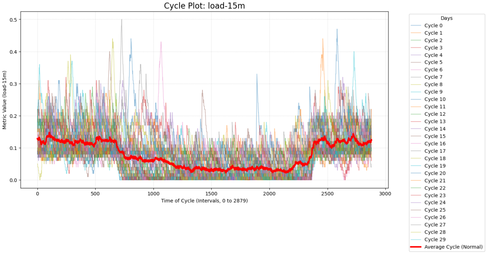
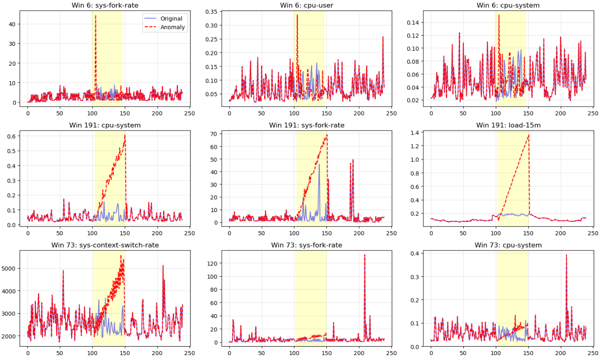
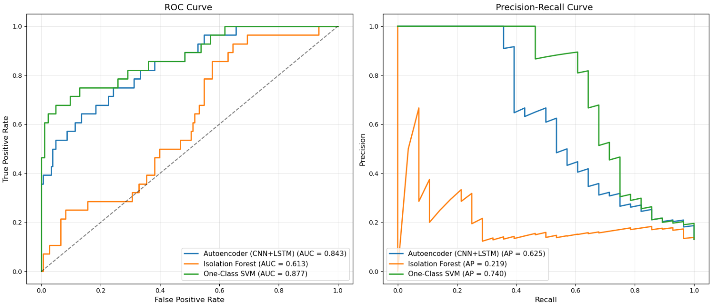

# Unsupervised Anomaly Detection for Time Series Data
This project investigates and compares unsupervised learning methods for anomaly detection within multivariate time series of server performance metrics.
# 1. Key Features:
- **Multivariate Analysis**: Simultaneous processing of 6 interrelated metrics: load-15m, cpu-user, cpu-system, sys-fork-rate, sys-interrupt-rate, and sys-context-switch-rate.
- **CAP Algorithm (Cut-Add-Paste)** : Employs a synthetic anomaly injection method to objectively evaluate model performance in the absence of labeled data [1].
- **Hybrid Deep Learning Architecture**: A CNN-LSTM Autoencoder where CNN layers extract local features and LSTM layers capture long-term temporal dependencies.
- **Comparative Analysis**: Benchmarking the deep learning approach against classical machine learning methods (Isolation Forest and One-Class SVM).

# 2. Data & Preprocessing
The project utilizes the open-source Westermo Test System Performance dataset (specifically data from system-2) [2].

## Preparation Pipeline:
1.	**Decomposition**: Seasonal components (circadian rhythms) were removed to extract the residuals.
2.	**Data Split**: 70% of the data was used for training, 30% was reserved for testing.
3.	**Anomaly Synthesis**: Using the CAP algorithm, various anomalies (trends, spikes, and shifts) were integrated into the test set while preserving natural seasonality to test model robustness.

**Figure 1:** Circadian Rhythms for load-15 metric.

---

**Figure 2:** Generated anomalies using CAPMix.

# 3. Obtained Results

| Model             | F1 Score | Precision | Recall  |
|-------------------|----------|-----------|---------|
| One-Class SVM     | 0.7234   | 0.8947    | 0.6071  |
| Autoencoder       | 0.5769   | 0.6250    | 0.5357  |
| Isolation Forest  | 0.3019   | 0.1832    | 0.8571  |

**Table 1:** Performance Metrics Comparison

**Figure 3:** ROC and Precision-Recall Curves Visualization.

Analyzing the ROC Curve, we observe that the One-Class SVM curve is located closest to the upper-left corner. This indicates that it provides the best separation between “normal” and “anomalous” data while maintaining a minimal error rate.

On the Precision–Recall Curve, we can see that One-Class SVM maintains high Precision even as Recall increases. In contrast, Isolation Forest drops sharply downward. This suggests that the model effectively “panics” and labels a large number of instances as anomalies in an attempt to capture the true deviations, resulting in a substantial number of false positives.

# Conclusion

While Isolation Forest achieved the highest Recall (0.8571), its extremely low Precision (0.1832) results in excessive "noise" and false alarms, reflected in its low F1-score.

One-Class SVM is the optimal choice based on the overall metric balance. 

The Autoencoder is a promising alternative for detecting complex patterns, provided further hyperparameter optimization is performed.

# References

[1] Mou, Xudong, et al. "CAPMix: Robust Time Series Anomaly Detection Based on Abnormal Assumptions with Dual-Space Mixup." Online at: https://arxiv.org/abs/2509.06419.

[2] P. E. Strandberg, Y. Marklund. The Westermo test system performance data set. Online at: https://github.com/westermo/test-system-performance-dataset/tree/main.
